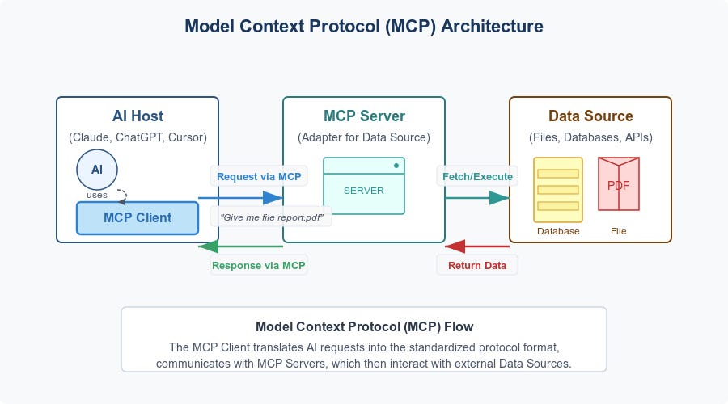
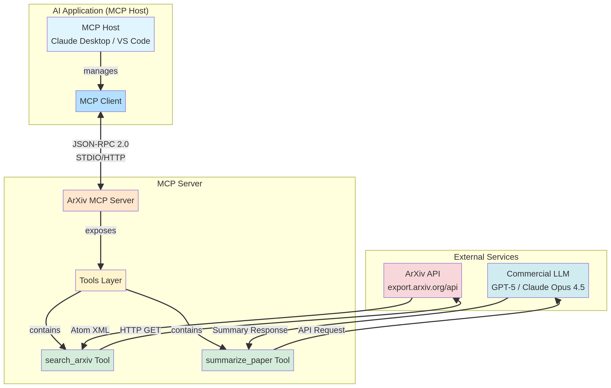
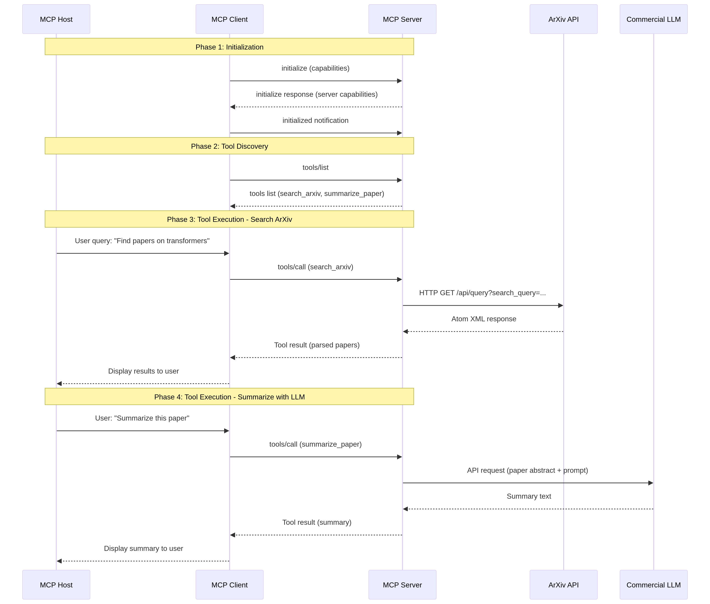

# Building an Intelligent ArXiv Explorer with MCP and Commercial LLMs

**Author:** Manus AI
**Date:** January 1, 2026

## 1. Introduction

Welcome to this comprehensive, step-by-step guide to building a powerful research assistant using the Model Context Protocol (MCP). In this tutorial, we will construct an MCP server that acts as a bridge between an AI application, the vast repository of academic papers on ArXiv, and the advanced summarization capabilities of commercial Large Language Models (LLMs) like OpenAI's GPT series and Anthropic's Claude models. This server will empower AI agents to search for research papers, retrieve detailed information, and generate concise summaries on demand.

The **Model Context Protocol (MCP)** is an open-source standard designed to facilitate seamless communication between AI applications (like AI-powered IDEs or desktop assistants) and external systems, tools, and data sources [1]. By creating an MCP server, you can extend the capabilities of an AI, allowing it to interact with APIs, databases, or local files in a structured and secure manner.

This tutorial is designed for developers with a foundational understanding of Python and familiarity with REST APIs. By the end, you will have a fully functional MCP server, a clear understanding of the underlying architecture, and the knowledge to build your own custom MCP integrations.

### What We Will Build

We will develop an MCP server with the following tools:

*   **`search_arxiv`**: A tool to search for papers on ArXiv based on a query.
*   **`get_arxiv_paper`**: A tool to retrieve the full abstract and metadata for a specific paper by its ID.
*   **`summarize_paper_with_llm`**: A tool that fetches a paper's abstract and uses a commercial LLM to generate a high-quality summary.
*   **`search_and_summarize`**: A convenient workflow tool that combines search and summarization in a single step.

This project will demonstrate the core principles of MCP server development, API integration, and how to chain multiple services together to create a sophisticated AI-powered workflow.

## 2. Core Concepts and Architecture

Before we dive into the code, it's essential to understand the key components and the flow of information in our system. Our project involves three main pillars: the Model Context Protocol, the ArXiv API, and the LLM APIs.

### Model Context Protocol (MCP) Architecture

MCP operates on a client-server model, which consists of three main participants [2]:

| Participant | Role                                                                 | Example in our Project                                    |
| :---------- | :------------------------------------------------------------------- | :-------------------------------------------------------- |
| **MCP Host**  | The AI application that manages connections to one or more servers.  | Claude Desktop, an AI-powered IDE, or a custom application. |
| **MCP Client**  | A component within the host that maintains a dedicated connection to a single MCP server. | An object instantiated by the Host to talk to our server. |
| **MCP Server**  | A program that provides context, tools, or resources to the client.   | The `src/arxiv_mcp/server.py` module we will build.       |


*Figure 1: A high-level overview of the MCP architecture, showing the interaction between the AI Host, MCP Server, and external Data Sources.* [Source: modelcontextprotocol.io]

Communication between the client and server is handled by a transport layer, which can be **STDIO** (Standard Input/Output) for local servers or **Streamable HTTP** for remote servers. The data itself is exchanged using a structured **JSON-RPC 2.0** protocol [2].

### ArXiv and LLM APIs

*   **ArXiv API**: Cornell University provides a public API for accessing the vast collection of e-prints on ArXiv. The API allows us to query for papers using various fields (title, author, abstract) and returns metadata in an Atom 1.0 XML format [3]. We will write functions to construct these queries and parse the XML responses.

*   **Commercial LLM APIs**: Services like OpenAI and Anthropic provide powerful APIs for text generation, summarization, and more. We will integrate with these services by sending them a paper's abstract along with a carefully crafted prompt, instructing them to produce a concise summary. Access to these APIs requires an API key, which we will manage securely using environment variables.

### Our Project's Architecture

The complete workflow for our ArXiv MCP server involves a sequence of interactions between all these components. The user initiates a request from the MCP Host, which is translated into a tool call to our server. Our server then communicates with the appropriate external API (ArXiv or an LLM) and returns the final result to the user.


*Figure 2: The complete workflow diagram for our project, illustrating the relationships between the MCP Host, our MCP Server, the ArXiv API, and a Commercial LLM.*

The sequence diagram below provides a more detailed look at the step-by-step communication process for discovering and executing the tools.


*Figure 3: A sequence diagram showing the lifecycle of an MCP interaction, from initialization and tool discovery to the execution of the `search_arxiv` and `summarize_paper_with_llm` tools.*

## 3. Prerequisites and Environment Setup

Let's get your development environment ready. This section covers the system requirements, API key acquisition, and the steps to set up the project structure.

### System Requirements

*   **Python 3.10 or higher**: The code uses modern Python features.
*   **`pip` and `venv`**: For managing packages and virtual environments.
*   **API Keys (Optional)**: To use the summarization feature, you will need an API key from either [OpenAI](https://platform.openai.com/signup) or [Anthropic](https://console.anthropic.com/signup).

### Project Setup

We have prepared a simple shell script to automate the setup process. First, create the project directory and navigate into it.

```bash
mkdir mcp-arxiv-tutorial
cd mcp-arxiv-tutorial
```

Now, run the provided `setup.sh` script. This will create a Python virtual environment and install all the necessary dependencies from `requirements.txt`.

```bash
# First, ensure the script is executable
chmod +x setup.sh

# Run the setup script
./setup.sh
```

After the script completes, activate the virtual environment and export your API keys.

```bash
# Activate the virtual environment
source venv/bin/activate

# Export your API keys (replace with your actual keys)
export OPENAI_API_KEY='your-openai-api-key'
export ANTHROPIC_API_KEY='your-anthropic-api-key'
```

Your environment is now ready!

## 4. Building the MCP Server: A Step-by-Step Guide

Now we will walk through the `src/arxiv_mcp/server.py` file, explaining each section in detail. The full, commented code is available in the project directory.

### Step 1: Imports and Initial Configuration

We begin by importing the necessary libraries. We use `httpx` for making asynchronous API calls, `xml.etree.ElementTree` for parsing ArXiv's XML responses, and `FastMCP` from the `mcp` library to build our server.

```python
import os
import logging
from typing import Any, Optional
import xml.etree.ElementTree as ET

import httpx
from mcp.server.fastmcp import FastMCP

# Configure logging to stderr
logging.basicConfig(level=logging.INFO, format='%(asctime)s - %(levelname)s - %(message)s')
logger = logging.getLogger(__name__)

# Initialize FastMCP server
mcp = FastMCP("arxiv-search")
```

**Crucially**, we configure logging to write to `stderr`. For STDIO-based MCP servers, writing anything to `stdout` (e.g., with `print()`) will corrupt the JSON-RPC message stream and cause the connection to fail.

### Step 2: Interacting with the ArXiv API

We need helper functions to handle communication with the ArXiv API. The `make_arxiv_request` function sends an HTTP GET request, and `parse_arxiv_entry` extracts the relevant metadata from the XML elements in the response.

```python
async def make_arxiv_request(url: str) -> Optional[str]:
    # ... (Implementation in src/arxiv_mcp/server.py)

def parse_arxiv_entry(entry: ET.Element) -> dict[str, Any]:
    # ... (Implementation in src/arxiv_mcp/server.py)
```

### Step 3: Integrating with LLM APIs

Next, we create functions to call the OpenAI and Anthropic APIs. These functions construct the appropriate request payload, including the model name and the prompt, and send it to the respective API endpoint. They handle authentication by reading the API keys from the environment variables we set earlier.

```python
async def call_openai_api(prompt: str, model: str = "gpt-4") -> Optional[str]:
    # ... (Implementation in src/arxiv_mcp/server.py)

async def call_anthropic_api(prompt: str, model: str = "claude-3-5-sonnet-20241022") -> Optional[str]:
    # ... (Implementation in src/arxiv_mcp/server.py)
```

### Step 4: Defining MCP Tools

This is the core of our MCP server. We define functions and decorate them with `@mcp.tool()` to expose them to the MCP Host. The `FastMCP` library automatically generates the tool definitions from the function's signature and docstring, which the AI uses to understand how to call the tool.

Here is the definition for our `search_arxiv` tool:

```python
@mcp.tool()
async def search_arxiv(query: str, max_results: int = 10, sort_by: str = "relevance") -> str:
    """
    Search ArXiv for papers matching a query.
    
    Args:
        query: Search query string (e.g., "machine learning")
        max_results: Maximum number of results to return (default: 10)
        sort_by: Sort order - "relevance", "lastUpdatedDate", or "submittedDate"
    
    Returns:
        A formatted string containing paper metadata.
    """
    # ... (Implementation in src/arxiv_mcp/server.py)
```

The docstring is critical, as it serves as the description provided to the LLM, guiding it on the tool's purpose and parameters.

### Step 5: Running the Server

Finally, the `main` function initializes and runs the server. The `mcp.run(transport="stdio")` call starts the server, which will now listen for incoming JSON-RPC messages from an MCP client over standard input and send responses over standard output.

```python
def main():
    logger.info("Starting ArXiv MCP Server...")
    mcp.run(transport="stdio")

if __name__ == "__main__":
    main()
```

## 5. Testing and Using Your Server

With the server built, you can test it in several ways.

### Method 1: Using the Test Client

We have included a `test_client.py` script that programmatically connects to the server and calls its tools. This is an excellent way to perform automated testing.

```bash
# Make sure your virtual environment is active and API keys are set
python test_client.py
```

You should see the client connect, list the available tools, and then execute a series of tests, printing the results to your console.

### Method 2: Integrating with Claude Desktop

To use your server with a real-world MCP Host like Claude Desktop, you need to tell the application how to find and run your server. This is done by editing the `claude_desktop_config.json` file.

1.  Locate the configuration file. On macOS, it is at `~/Library/Application Support/Claude/claude_desktop_config.json`.
2.  Add an entry for your server, making sure to use the **absolute path** to your `ArXiv_MCP` directory.

```json
{
  "mcpServers": {
    "arxiv-search": {
      "command": "uv",
      "args": [
        "--directory",
        "/absolute/path/to/your/project/ArXiv_MCP",
        "run",
        "arxiv-mcp"
      ],
      "env": {
        "OPENAI_API_KEY": "your-openai-api-key-here",
        "ANTHROPIC_API_KEY": "your-anthropic-api-key-here"
      }
    }
  }
}
```

After saving the file and restarting Claude Desktop, your `arxiv-search` server will appear as a usable Connector, ready to assist with your research tasks.

## 6. Conclusion

Congratulations! You have successfully built, tested, and deployed a sophisticated MCP server that integrates with external APIs to provide powerful new capabilities to an AI assistant. You have learned about the core architecture of MCP, how to define tools, and how to connect your server to a real-world AI application.

From here, the possibilities are endless. You could extend this server to search other academic databases, connect to a reference manager like Zotero, or even add tools for analyzing the full text of papers. The Model Context Protocol provides a robust and standardized framework for expanding the horizons of what AI can achieve.

---

### References

[1] Model Context Protocol. (2025). *What is the Model Context Protocol (MCP)?* Retrieved from https://modelcontextprotocol.io/

[2] Model Context Protocol. (2025). *Architecture overview*. Retrieved from https://modelcontextprotocol.io/docs/learn/architecture

[3] Cornell University. (n.d.). *arXiv API User's Manual*. Retrieved from https://info.arxiv.org/help/api/user-manual.html
